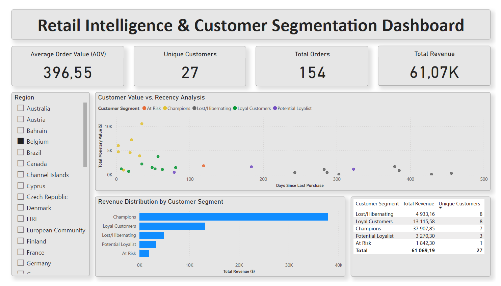

# 🛒 Dashboard Analityczny: Retail Intelligence i Segmentacja Klientów

## 📌 Przegląd Projektu
**Rola:** BI Developer / Analityk Danych  
**Domena:** E-commerce i Handel Detaliczny  
**Stos Technologiczny:**
* 🐍 **Python (Pandas):** Ekstrakcja, czyszczenie i wstępne przetwarzanie danych (ETL).
* 📗 **Excel (Power Pivot):** Zaawansowane modelowanie danych (Model Gwiazdy / Star Schema) i tworzenie miar DAX.
* 📊 **Power BI:** Projektowanie interaktywnego dashboardu i wizualizacja danych.

Projekt ten polegał na przekształceniu ponad **500 000 surowych logów transakcyjnych** brytyjskiego detalisty internetowego w strategiczny dashboard Business Intelligence. Głównym celem było odejście od marketingu masowego na rzecz celowanych strategii utrzymania klientów (retention) poprzez wdrożenie zaawansowanej segmentacji.

---

## 💼 Problem Biznesowy i Rozwiązanie

**Wyzwanie:**
Firma e-commerce borykała się z wysokim wskaźnikiem odejść klientów (churn), ale brakowało jej wiedzy na temat tego, *kto* odchodzi i *dlaczego*. Surowe dane transakcyjne były zanieczyszczone – zawierały zwroty, duplikaty i brakujące identyfikatory klientów, co uniemożliwiało ich analizę w pierwotnym stanie.

**Rozwiązanie:**
Zbudowałem kompleksowe rozwiązanie BI (end-to-end), które przetwarza surowe dane, modeluje je w wydajny Schemat Gwiazdy (Star Schema) i wizualizuje kluczowe wnioski przy użyciu **Segmentacji RFM (Recency, Frequency, Monetary)**.

**💡 Kluczowe Wnioski Biznesowe (Insights):**
* **Potwierdzenie Zasady Pareto:** Analiza wykazała, że **~20% najlepszych klientów (segmenty Champions i Loyal) generuje ~80% całkowitego przychodu**.
* **Alert Retencyjny:** Znaczna część klientów o wysokiej wartości została zidentyfikowana w segmencie "Zagrożeni" (At Risk - spadający wskaźnik świeżości zakupów), co wskazuje na pilną potrzebę kampanii reaktywacyjnych.
* **Wpływ Jakości Danych:** Usunięto ~20% "szumu" informacyjnego (zakupy bez rejestracji, zwroty), aby zapewnić dokładne obliczenie Życiowej Wartości Klienta (CLV).

---

## ⚙️ Podejście Techniczne

### 1. Inżynieria Danych i ETL (Python)
* **Skrypt:** `src/etl_pipeline.py`
* Wykorzystanie biblioteki **Pandas** do budowy solidnego potoku ETL:
    * **Ekstrakcja (Extraction):** Wczytanie surowych danych CSV/Excel.
    * **Transformacja (Transformation):**
        * Usunięcie rekordów z brakującym `CustomerID` (kluczowe dla analizy na poziomie klienta).
        * Odfiltrowanie anulowanych transakcji (gdzie `InvoiceNo` zaczyna się od 'C'), aby analizować sprzedaż netto.
        * Obsługa konwersji typów danych (daty, liczby zmiennoprzecinkowe) w celu bezproblemowego importu do modelu danych.
    * **Ładowanie (Loading):** Eksport czystych, przetworzonych danych do pliku CSV gotowego do modelowania.

### 2. Modelowanie Danych i DAX (Excel Power Pivot)
* **Plik:** `reports/Retail_Analytics_Data_Model.xlsx`
* Zaprojektowanie wydajnego **Modelu Gwiazdy (Star Schema)** w celu optymalizacji responsywności dashboardu:
    * **Tabela Faktów:** `Fact_Transactions` (Szczegółowe dane sprzedażowe).
    * **Tabele Wymiarów:** `Dim_Customers` (Klienci), `Dim_Products` (Produkty), `Dim_Calendar` (Kalendarz).
* Ustanowienie **relacji Jeden-do-Wielu (One-to-Many)** między wymiarami a tabelą faktów.
* Stworzenie bazowych **miar DAX** dla KPI:
    * `Total Revenue := SUM(Fact_Transactions[TotalSales])` (Całkowity Przychód)
    * `Total Orders := DISTINCTCOUNT(Fact_Transactions[InvoiceNo])` (Liczba Zamówień)
    * `AOV := DIVIDE([Total Revenue], [Total Orders])` (Średnia Wartość Koszyka)

### 3. Zaawansowana Analityka: Segmentacja RFM (DAX)
Implementacja złożonej logiki biznesowej wewnątrz modelu danych w celu oceny klientów:
* **Obliczenie Recency (Świeżość):** Użycie funkcji `DATEDIFF` z przejściem kontekstu (`CALCULATE` + `ALL`) do dynamicznego określenia liczby dni od ostatniego zakupu dla każdego klienta.
* **Logika Punktacji (Scoring):** Utworzenie kolumn obliczeniowych przypisujących punkty (1-5) za wartości R, F i M w oparciu o reguły biznesowe (np. 20% klientów z najwyższymi wydatkami otrzymuje 5 punktów).
* **Finalna Segmentacja:** Użycie instrukcji `SWITCH` do pogrupowania klientów w nazwane segmenty, takie jak "Champions" (Czempioni), "Loyal" (Lojalni), "At Risk" (Zagrożeni) i "Lost" (Utraceni), na podstawie ich łącznego wyniku.

### 4. Interaktywna Wizualizacja (Power BI)
* **Plik:** `reports/Retail_Executive_Dashboard.pbix`
* Zaprojektowanie czystego, przyjaznego dla użytkownika interfejsu zgodnie z **najlepszymi praktykami UI/UX** (układ Z-pattern, spójne kodowanie kolorami dla segmentów).
* **Kluczowe Wizualizacje:**
    * **Executive KPIs:** Karty z najważniejszymi metrykami (Przychód, Zamówienia, AOV) widoczne na pierwszy rzut oka.
    * **Linia Trendu Sprzedaży:** Analiza miesięcznych wyników w czasie.
    * **Wykres Punktowy RFM (Scatter Plot):** Potężna wizualizacja korelująca Świeżość (Recency) z Wartością Monetarną (Monetary), oznaczona kolorami według segmentów.
    * **Wykres Słupkowy Top Produktów:** Identyfikacja bestsellerów w celu optymalizacji zapasów.
* Implementacja dynamicznych **fragmentatorów (slicerów)** do filtrowania według Daty i Kraju.

---

## 🚀 Jak uruchomić ten projekt

1.  **Dane:** Projekt wykorzystuje zbiór danych [Online Retail II](https://archive.ics.uci.edu/ml/datasets/Online+Retail+II)